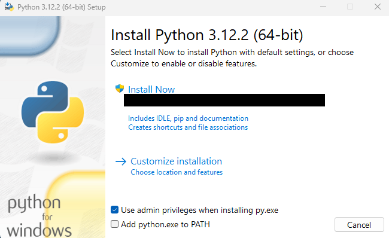
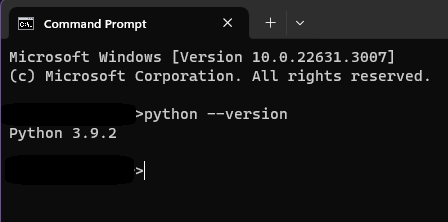
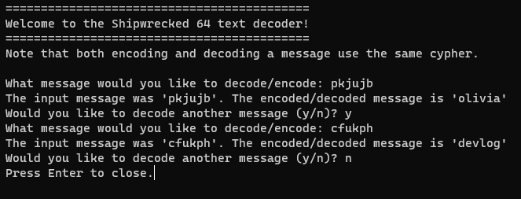

# Shipwrecked 64 Text Decoder

## About

This is a small command line decoder script for translating the text in Shipwrecked 64 found around the world, for example the labels on the tape players.

## The Decoder

The decoder is actually pretty simple, as has been noted by many people around the game. Essentially it's a shift cipher, where odd positioned letters starting from `a = 1`, `c = 3` etc. are shifted once right, and even positioned letters starting from `b = 2`, `d = 4` are shifted once left.

The interesting thing about this is that the process is reversable as a result of the way it's set up. Taking any individual letter and running it through the cipher infinitely many times will result in that letter oscillating between the same 2 letters next to each other in the alphabet. This means that for example, if we encode `Olivia` we get `pkjujb`, and then if you encode `pkjujb` you get back `Olivia` again. This isn't relevant to the working of the script, but it is interesting.

## Requirements

If you wish to run this script yourself, all you need to do is clone the repo, and ensure you have python installed on your PC. This script utilises f-strings and typing, therefore `Python 3.6` and above is required.

## Installation

To install Python, simply visit [this website](https://www.python.org/downloads/) and download the relevant installer for your version. Then you should be able to run. Ensure you tick "add python.exe to PATH" like below, as this allows you to run it from the command line. 

Once python is installed, you can check it's done correctly by opening the command line on your OS (`cmd` for Windows, likely `bash` for Mac and Linux) and typing `python --version`. If installed correctly this should give you the python version you just installed.  Now simply clone this repository somewhere on your PC.

## Usage

To use the script, navigate to it in the terminal using `cd C:/PATH/TO/FOLDER`, e.g. `cd C:/Users/user1/Downloads/Shipwrecked 64 Translator`. Run `python script.py` once in the correct folder. You should get a terminal pop-up requesting input. Simply input the text to translate and you're good to go. It's as simple as that, happy translating!
